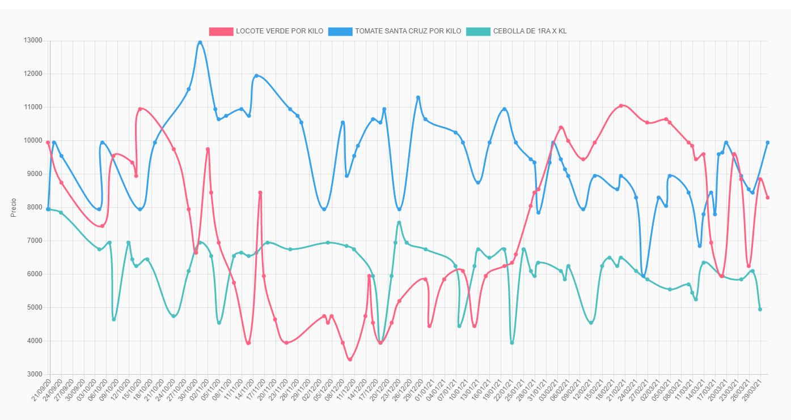

# Pricemory

Tracking and display of price history of products from Paraguay



It uses scrapy for scraping shops sites and django for web framework

### Tracked shops

- [Superseis](https://www.superseis.com.py)
- [Stock](https://www.stock.com.py)
- [Casa Rica](https://www.casarica.com.py/)
- [Nissei](https://www.casanissei.com)
- [Tupi](https://www.tupi.com.py/)
- [Los Jardines](https://losjardinesonline.com.py/)

## Requirements

- Python 3.6+
- PIP  
- Django 2.2+
- PostgreSQL 12+

## Installation

1. Clone and install project

```
git clone https://github.com/mauri-medina/pricemory.git
cd pricemory
python3 -m venv env
source env/bin/activate
pip install -r requirements.txt
cp .env.example .env
python manage.py runserver 0.0.0.0:8000

```

2. Configurations

- the existing values in .env can be used but is recommended to create a new secret key for django.

## Usage

### Run django

`python manage.py runserver 0.0.0.0:8000`

There is a [database](resources/db.zip) that can be used for testing

### Run spider

In crawler directory run:
<br>
`scrapy crawl spider-name`

The spider names are specified in their files, for example to run the spider from super seis:<br>
`scrapy crawl superseis_spider`

This will save the scrapped data to the database, to save in another formats
check [scrappy](https://docs.scrapy.org/en/latest/index.html) documentation

### Run all the spiders
`python crawler_runner.py`
<br>
<br>
The script [crawler_runner](crawler/crawler_runner.py) by default will run the
spiders sequentially, one spider after another, but other options are available in the script.

The runner output is logged in the file defined in the script

## Contributing

Pull requests are welcome.

Any help or feedback is appreciated, especially for the design of the site.

- Fork it!
- Create your feature branch: git checkout -b my-new-feature
- Commit your changes: git commit -am 'Add some feature'
- Push to the branch: git push origin my-new-feature
- Submit a pull request :D

## TODO

- General improve of site design
- Add more shops

## Contributors / Thanks

- Bruno Ostertag https://github.com/bostertag : Database cleanup and sql performance tuning.

## License

This project is licensed under the terms of the GNU General Public License v3.0
